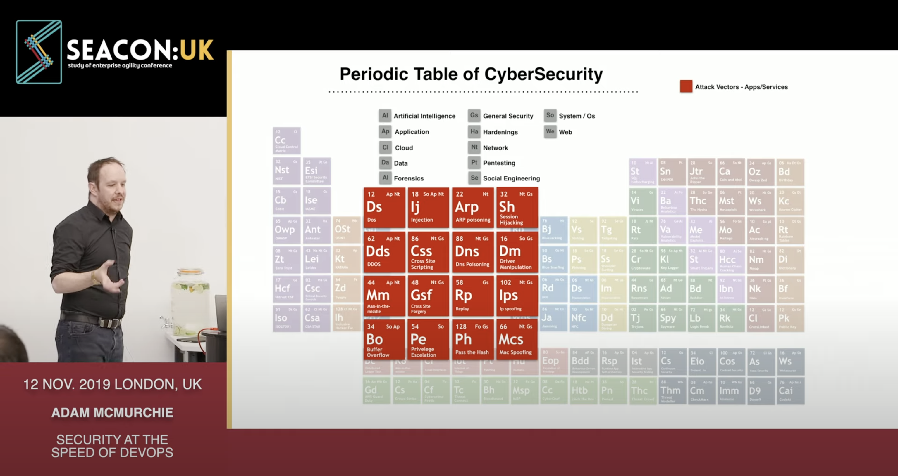
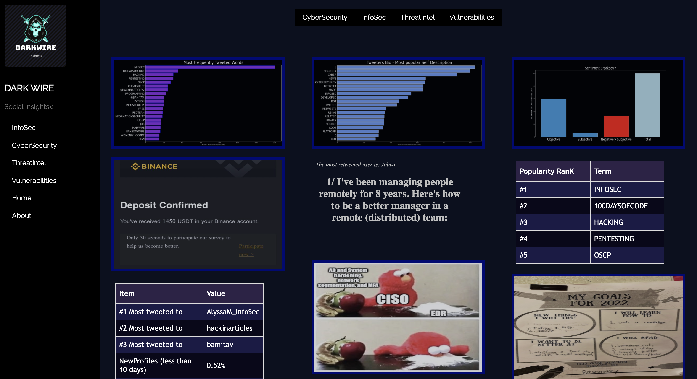

# Profile Summary 

   • 
   • 
   • 
   • 
  •  

  • 

	

## Be the Automator, not the Automated 

- ⚙️ Head of AI, DevOps & Cloud
- ❤️ `Custom AI`, `Crypto`, `GameDev`, `Infra as Code`, `blockChain`
- 🤖 AI, Machine Learning and NeuroComputing
- ⏩ `Old` meets `New`, from COBOL & Mainframe to Keras and Pyspark 

## Security at the Speed of DevOps

	

Intelligence As a Service [link](https://youtu.be/4rqZSLHPdR4) | Open Source as a Culture [link](https://youtu.be/fwcTOqZSzVM")
--- | ---
 | 

# InfoSec: DarkWire

	

A slightly different take on cybersecurity, information feeds are all from the public, twitter, reddit etc and parsed based upon word of mouth rather than traditional threat intelligence stats. Data, 
images, tweets and comments are all parsed automatically and do not reflect the opinion of the platform developer (me).  

[Darkwire](https://murchie85.github.io/darkwire/darkwire.html)

# Latest Data Project: Celestus The Gossip Town

	

In Yuval Harai's pivotal book Sapiens the author explains how Story Telling and collective belief define the human race. In fact these uniquely human characteristics may have helped differentiate Sapiens from their historical competitors and allowed us to thrive into the technological society we have today.

	

As such, i've designed a **Hyrbid ML Platform** that comes with a CLI, but can also be played and interacted with like a game. The goal is to simulate how gossip evolves over time and is leveraged by social agents (Bots, AI, and humans).

	

# Latest Game Project: Lifted

**Objective:** You have to hustle your way out of the city. Sell drugs, get a job, whatever it takes

Everything is hand coded, drawn and set up by myself including the entire game engine framework. It's painful, but gives me better control to build the game I want to see.
I hope you will enjoy it.
  

