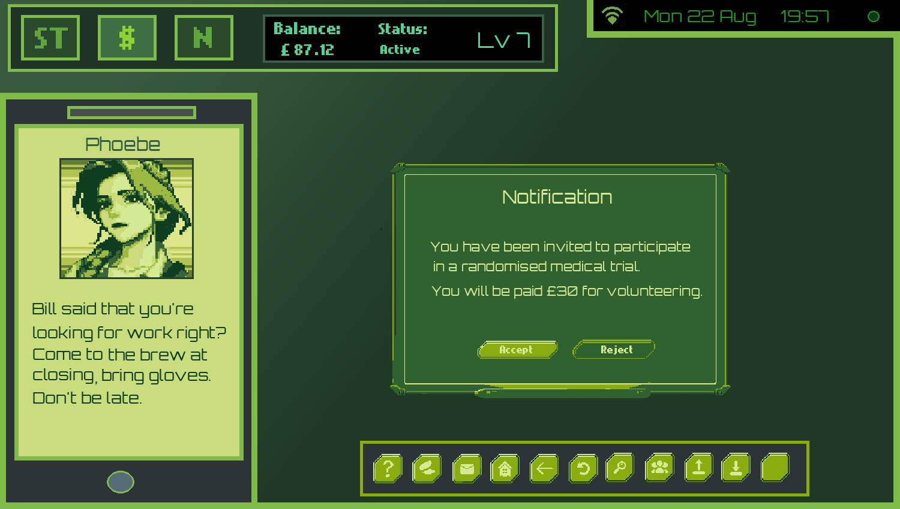
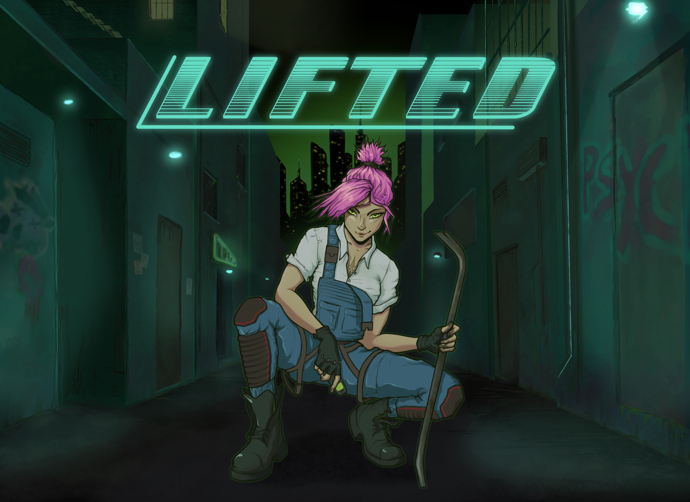

# Profile Summary 

   • 
   • 
   •  

	

# Latest Project: Lifted

**Objective:** You have to hustle your way out of the city. Sell drugs, get a job, whatever it takes

Everything is hand coded, drawn and set up by myself including the entire game engine framework. It's painful, but gives me better control to build the game I want to see.
I hope you will enjoy it.
  

